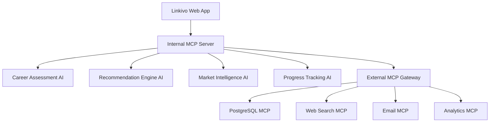

# MCP Integration Plan for Linkivo AI Career Coach

## Overview
This document outlines the staged implementation of Model Context Protocol (MCP) servers to enhance the Linkivo AI Career Coach platform, enabling AI agents to communicate with each other and access external data sources.

## Phase 1: Internal AI Communication Enhancement

### Current State
- Multiple AI components exist in isolation
- No inter-agent communication
- Limited data sharing between AI modules

### Enhancement Goal
Enable LLMs within the webapp to communicate with each other for:
- Cross-referencing user data
- Collaborative recommendation generation
- Shared learning and context

### Implementation Strategy

#### 1.1 Internal MCP Server Setup
```javascript
// Internal MCP Server for AI Communication
const internalMCPServer = {
  name: "linkivo-internal-ai-communication",
  version: "1.0.0",
  capabilities: [
    "user_profile_sharing",
    "recommendation_collaboration", 
    "context_synchronization",
    "progress_tracking"
  ]
}
```

#### 1.2 AI Agent Communication Protocol
- **Career Assessment AI** ↔ **Recommendation Engine AI**
- **Market Intelligence AI** ↔ **Goal Setting AI**
- **Progress Tracking AI** ↔ **All Other AIs**

#### 1.3 Use Cases for Internal Communication

**Use Case 1: Collaborative Recommendation Generation**
```
Career Assessment AI: "User John has improved communication skills by 40%"
Recommendation Engine AI: "Based on this progress, suggest advanced networking opportunities"
Market Intelligence AI: "Current market shows 60% demand for communication skills in tech"
→ Combined Output: "John, your communication growth aligns with market demand. Here are 3 networking events this week..."
```

**Use Case 2: Cross-Validation of User Progress**
```
Progress Tracking AI: "User Sarah completed 5 AI courses this month"
Goal Setting AI: "Sarah's goal was to complete 3 courses"
Career Assessment AI: "Sarah's AI Adaptation Quotient increased by 25%"
→ Combined Output: "Sarah exceeded her monthly goal! Your AI readiness score jumped significantly..."
```

## Phase 2: External MCP Integration

### 2.1 Priority MCP Servers (Based on suggestions.log)

#### Database/PostgreSQL MCP
- **Purpose**: Persistent memory and user journey tracking
- **Implementation**: Store assessments, skill metrics, recommendation history
- **MCP Server**: Use existing PostgreSQL MCP from [mcpservers.org](https://mcpservers.org/official)

#### Web Search/Research MCP
- **Purpose**: Real-time market intelligence
- **Implementation**: Dynamic skill demand analysis, salary trends
- **MCP Server**: Bright Data or Apify for web scraping

#### Email/Communication MCP
- **Purpose**: Automated user engagement
- **Implementation**: Personalized check-ins, progress reports
- **MCP Server**: Custom email MCP or integrate with existing email services

#### Analytics/Data Visualization MCP
- **Purpose**: Progress visualization and benchmarking
- **Implementation**: Skill heat maps, growth charts, peer comparisons
- **MCP Server**: Custom visualization MCP

### 2.2 Integration Architecture



## Phase 3: Advanced MCP Features

### 3.1 Multi-Agent Orchestration
- Implement agent hierarchy and decision trees
- Enable complex multi-step AI workflows
- Add conflict resolution between agents

### 3.2 Real-time Data Integration
- Live job market data
- Industry trend analysis
- Salary benchmarking

### 3.3 Predictive Analytics
- Career trajectory modeling
- Skill gap prediction
- Market opportunity identification

## Implementation Timeline

### Week 1-2: Internal Communication Setup
- [ ] Design internal MCP server architecture
- [ ] Implement basic AI-to-AI communication
- [ ] Create communication protocols
- [ ] Test with existing AI components

### Week 3-4: Database MCP Integration
- [ ] Set up PostgreSQL MCP server
- [ ] Migrate user data to MCP-accessible format
- [ ] Implement persistent memory features
- [ ] Test data retrieval and storage

### Week 5-6: Web Search MCP Integration
- [ ] Integrate web scraping MCP
- [ ] Implement market intelligence features
- [ ] Add real-time data updates
- [ ] Test recommendation accuracy

### Week 7-8: Communication & Analytics MCPs
- [ ] Set up email automation MCP
- [ ] Implement analytics visualization MCP
- [ ] Add progress tracking features
- [ ] Test end-to-end workflows

## Technical Requirements

### Dependencies
```json
{
  "mcp-sdk": "^1.0.0",
  "postgresql-mcp": "^1.0.0",
  "web-search-mcp": "^1.0.0",
  "email-mcp": "^1.0.0",
  "analytics-mcp": "^1.0.0"
}
```

### Configuration
```javascript
// MCP Configuration
const mcpConfig = {
  internal: {
    server: "ws://localhost:3001/mcp",
    timeout: 5000,
    retries: 3
  },
  external: {
    postgresql: {
      server: "postgresql-mcp://api.mcpservers.org",
      apiKey: process.env.POSTGRESQL_MCP_KEY
    },
    webSearch: {
      server: "web-search-mcp://api.mcpservers.org", 
      apiKey: process.env.WEB_SEARCH_MCP_KEY
    }
  }
}
```

## Success Metrics

### Phase 1 Metrics
- AI agent communication latency < 100ms
- Cross-agent data accuracy > 95%
- Recommendation relevance improvement > 30%

### Phase 2 Metrics
- Real-time data freshness < 1 hour
- User engagement increase > 40%
- Recommendation personalization score > 85%

### Phase 3 Metrics
- Multi-agent workflow success rate > 90%
- Predictive accuracy > 80%
- User retention improvement > 50%

## Risk Mitigation

### Technical Risks
- **MCP Server Downtime**: Implement fallback mechanisms
- **Data Privacy**: Ensure all MCPs comply with GDPR
- **Performance Impact**: Monitor and optimize MCP calls

### Business Risks
- **Cost Management**: Monitor MCP usage and costs
- **Vendor Lock-in**: Use abstraction layers for MCP services
- **User Experience**: Maintain seamless integration

## Next Steps

1. **Immediate**: Set up development environment for MCP testing
2. **Short-term**: Implement internal AI communication
3. **Medium-term**: Integrate external MCP servers
4. **Long-term**: Build advanced multi-agent workflows

---

*This plan will be updated as we progress through each phase and learn from implementation challenges.*
